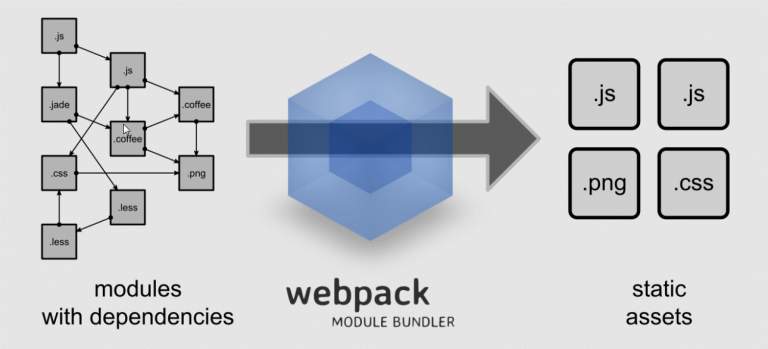
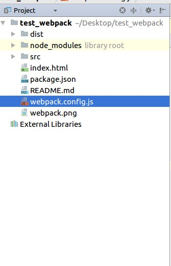
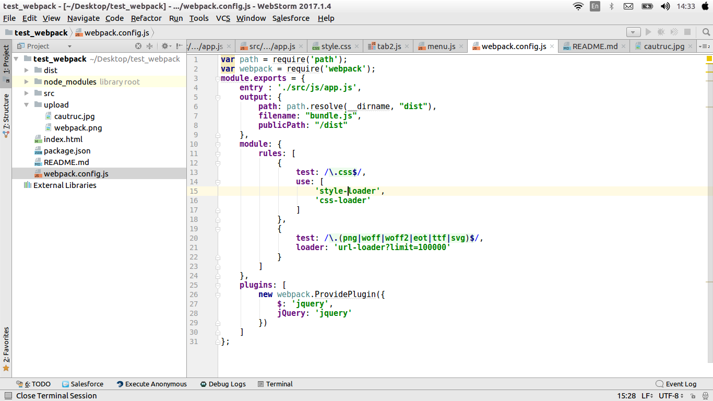

#Giới thiệu về webpack :

Cùng với sự phát triển của các Framework Javascript và CSS, các website ngày càng sử dụng nhiều hơn mã Javascript, CSS giúp nâng cao trải nghiệm người dùng. Với các Framework Javascript mạnh mẽ như Vue.js, React, Angular… việc xây dựng website có tính tương tác cao, tải nhanh chóng, sử dụng mô hình ứng dụng đơn trang trở lên đơn giản. Cũng chính vì lẽ đó, số lượng các thư viện, các module sử dụng trong ứng dụng trở lên không kiểm soát nổi khi hệ thống website phình ra. Khi đó, mã nguồn cần được thiết kế sao cho quản lý được tốt là một vấn đề. Có rất nhiều các hệ thống quản lý module nổi tiếng như Browserify, RequireJS… tuy nhiên **Webpack làm tốt hơn cả** với nhiều tính năng nổi trội.
#Bắt đầu với webpack :


#Mục tiêu của Webpack :

Về ý tưởng Webpack là **một công cụ đóng gói các module và các thư viện phụ thuộc thành các file tĩnh**, mục tiêu Webpack muốn đạt được là:

* Chia nhỏ toàn bộ tài nguyên các thư viện và các tài nguyên phụ thuộc thành các “chunk” và chỉ tải các thành phần nhỏ này khi cần thiết.
* Giúp quá trình tải các tài nguyên nhanh.
* Mọi file tĩnh sau quá trình đóng gói sẽ ở dạng module.
* Cho phép tích hợp các thư viên bên thứ ba ở dạng module.
* Cho phép cá nhân hóa mọi thành phần của công cụ đóng gói module.
* Thích hợp cho cả những dự án cực lớn.
#Cách sử dụng :

## Các bước cài đặt webpack:
* B1:Để cài đặt webpack đầu tiên ta phải cài nodejs và npm,tạo foder.Ví dụ : test_webpack.
* B2:npm init -y. Tạo 1 file node package . -y là yes cm nó hết các bước version, decription,...
* B3:npm install --save-dev webpack

## Hướng dẫn sử dụng webpack qua ví dụ test_webpack

* Đầu tiên ta tạo file index.html và thư mục src.Trong thư mục src có 2 folder: css và js
* Trong mục css có 2 file :style.css và tab.css.
* Trong muc js:app.js và menu.js ,tab.js.

## Bắt đầu nén:
#### Nén js:
* Trong file app.js  sẽ import các file js:
* import './menu.js';
* import './tab.js';
* Ta sẽ import bao nhiêu file js tùy ý .Ở đây có 2 file js nên mình chỉ import 2 file
#### Nén css:
* Trong file app.js  sẽ import các file css:
* import '../css/style.css';
* import '../css/tab.css';
* Ta sẽ import bao nhiêu file css tùy ý .Ở đây có 2 file css nên mình chỉ import 2 file
#### Cách nén thứ nhất: 
* Sau đó ta gõ webpack ./src/js/app.js ./dist/bundle.js để thực hiện quá trình nén file
* Sau khi nén sẽ xuất hiện folder dist là được. Tiếp theo ở file index.html ta chỉ cần  <script src="./dist/bundle.js"></script>
là ta có thể sử dụng js và css sau khi nén

#### Cách nén thứ hai dùng file config và cài webpack server:
* Để cài webpack server chạy : npm i --save-dev webpack-dev-server
* Đầu tiên bạn tạo 1 file webpack.config.js như hình dưới đây :


* Sau đó bạn config như hình dưới đây hoặc bạn có thể chỉnh sửa theo ý của mình:


* entry – tên của file hoặc một mảng những file mà chúng ta muốn include.Trong ví dụ này, chúng ta dùng 1 file duy nhất là app.js.
* output – là một object chứa những thiết lập output. Ở đây chúng ta dùng path để lấy đường dẫn đến folder dist có chứa file bundle.js.Nói chung đây là file chứa các file mình cần nén
* module – là nơi giúp ta đọc các file css,js,scss,less,... 
* plugin – là cái mà sau khi nén file nó sẽ thực hiện các chức năng khác như :nén thành mini file hoặc cài đặt jquery.

* Bạn chỉ cần gõ phần entry và output thôi còn phần module và plugin mình sẽ giải thích sau.
* Tiếp theo trong file package.json bạn gõ :

`
    
    "scripts": {
    "test": "echo \"Error: no test specified\" && exit 1",
    
    "build": "webpack-dev-server -p"
    }
  `
* Build webpack-dev-server -p là nén mini file,còn Build webpack-dev-server là nén file
* Cuối cùng chỉ cần gõ npm run build là webpack sẽ nén.
     
## Cách dùng boostrap cho webpack :
* B1 :  npm install bootstrap --save-dev.
* B2 : import 'bootstrap/dist/css/bootstrap.css'; trong file app.js 
* B3 : Viết module trong webpack.config.js
```script
   module: {
           rules: [
               {
                   test: /\.css$/,
                   use: [
                       'style-loader',
                       'css-loader'
                   ]
               },
               {
                   test: /\.(png|woff|woff2|eot|ttf|svg)$/,
                   loader: 'url-loader?limit=100000'
               }
           ]
       }
```       
* B4 : thêm một thẻ của boostrap ví dụ : <button class="btn btn-success">Bootstrap button</button>.Để test xem boostrap hoạt động chưa       
* B5 : npm run build để chạy . Gõ localhost do webpack cấp lên brower và hưởng thụ thành quả.
## Cách dùng jquery cho webpack
* B1 :  npm install --save jquery.
* B2 : import 'jquery'; 
* B3 : Viết plugin trong webpack.config.js:

```script
    plugins: ['

           new webpack.ProvidePlugin({
                $: 'jquery',
                jQuery: 'jquery'
            })
        ]
```        
  * Nếu không có plugin này thì khi cài jquery xong và chạy thì trên trình duyệt chỗ console sẽ báo **$ is not defined** vì vậy để khắc phục lỗi ta chỉ cần thêm vào plugin là ok         
* B4 và B5 tương tự.
# Một vài thông số sau khi dùng webpack
* Ví dụ :
````
Trước khi nén dung lượng tổng các file cần nén là 

Sau khi nén vào file bundle.js thì dung lượng là 
````